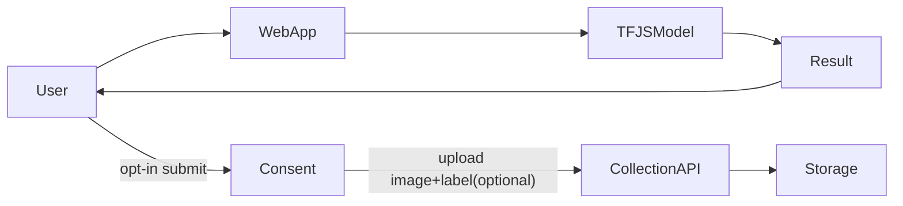

# Plan Deploy di Vercel (TFJS Client-Side) + Dataset Publik + Consent Pengumpulan Data

## Tujuan

Aplikasi web di Vercel untuk user awam: upload gambar → dapat prediksi **Phishing vs Genuine** + skor, dengan UI **minimal-clean** dan edukasi yang jelas. Dataset/training info **dipublikasikan**, serta tersedia opsi **opt-in** untuk mengirim gambar user guna perbaikan model.

## Keputusan Arsitektur

- **Inference di browser (TensorFlow.js)** untuk prediksi utama (cocok Vercel).
- **Opsional data collection**: endpoint terpisah untuk upload contoh dari user **hanya jika user setuju (opt-in)**.
- Ini berarti ada komponen backend ringan (bisa Vercel Serverless/Edge) khusus untuk menyimpan file atau meneruskan ke storage (lebih aman dibanding menjalankan TensorFlow di server).

## Alur Sistem

## Tahap 1 — Dataset & Training Disclosure (supaya awam paham tanpa kebanyakan detail)

Buat konten **Model Card** (halaman About) yang menjelaskan:

- **Tujuan model**: deteksi indikasi phishing dari screenshot.
- **Dataset**: sumber, jumlah gambar per kelas, contoh, cara labeling.
- **Metrik**: accuracy + precision/recall/F1 + confusion matrix (minimal).
- **Batasan**: domain shift, kualitas screenshot, UI baru, bahasa, dark mode, dll.
- **Cara pakai yang aman**: hasil bukan kepastian; sarankan cek URL, sertifikat, domain, dll.
- **Privasi**:
- Prediksi default berjalan lokal di device.
- Pengiriman gambar hanya jika opt-in.

Jika dataset dipublikasi, pastikan ada:

- Lisensi dataset
- Struktur folder yang jelas + README
- (Opsional) script untuk reproduce training

## Tahap 2 — Export model & Convert ke TFJS

- Rapikan notebook/script supaya urut: dataset → build → train → evaluasi → export.
- Convert ke TFJS (`tensorflowjs_converter`) menghasilkan `model.json` + weight shards.
- Taruh di `public/model/`.

## Tahap 3 — Web App (Next.js di Vercel)

### UI minimal-clean (custom, non-template)

- Single page dengan 2 panel: upload/preview dan hasil.
- Copywriting untuk awam:
- “Ini alat bantu, bukan keputusan final.”
- “Kalau ragu, jangan login/masukkan OTP.”
- State yang wajib:
- Model loading
- Preview gambar
- Hasil (label + probabilitas)
- Error (file bukan gambar/terlalu besar)

### Client inference

- Preprocess: RGB + resize 180x180 → tensor `(1,180,180,3)`.
- Predict: logit → sigmoid → prob.
- Threshold default 0.5, tapi UI bisa jelaskan arti “skor”.

## Tahap 4 — Opt-in Data Collection (untuk improve model)

Karena kamu ingin mengumpulkan data user, ini harus rapi:

- Tambah toggle/checkbox jelas: “Saya setuju mengirim gambar ini untuk riset dan peningkatan model.”
- Jelaskan: